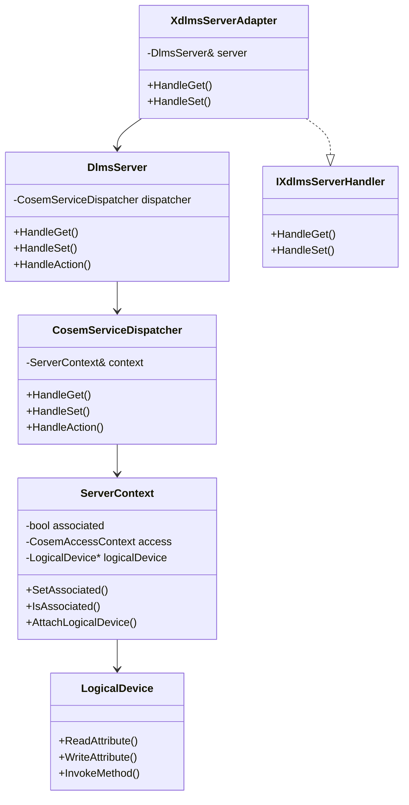

# dlms-server API

## 1. Public Headers

Planned headers:

```text
include/dlms/server/server_status.hpp
include/dlms/server/server_types.hpp
include/dlms/server/server_context.hpp
include/dlms/server/service_dispatcher.hpp
include/dlms/server/dlms_server.hpp
include/dlms/server/xdlms_server_adapter.hpp
```

No C ABI is planned for the first implementation.

## 2. Status Contract

`ServerStatus` shall contain:

- `Ok`
- `InvalidArgument`
- `NotAssociated`
- `NoLogicalDevice`
- `ObjectNotFound`
- `AccessDenied`
- `AttributeNotFound`
- `MethodNotFound`
- `ObjectError`
- `UnsupportedFeature`
- `EncodeRequired`
- `InternalError`

The dispatcher maps `dlms-cosem::CosemStatus` to `ServerStatus` without losing
meaning where possible.

## 3. Request Types

`ServerGetRequest`:

- `invokeId`;
- `CosemAttributeDescriptor descriptor`.

`ServerSetRequest`:

- `invokeId`;
- `CosemAttributeDescriptor descriptor`;
- `CosemByteBuffer data`.

`ServerActionRequest`:

- `invokeId`;
- `CosemMethodDescriptor descriptor`;
- `CosemByteBuffer parameter`.

The first implementation uses request models, not APDU byte views.

## 4. Response Types

`ServerGetResponse`:

- `invokeId`;
- `ServerStatus status`;
- `bool hasData`;
- `CosemByteBuffer data`.

`ServerSetResponse`:

- `invokeId`;
- `ServerStatus status`.

`ServerActionResponse`:

- `invokeId`;
- `ServerStatus status`;
- `bool hasData`;
- `CosemByteBuffer data`.

## 5. Server Context

```cpp
class ServerContext
{
public:
  void SetAssociated(bool associated);
  bool IsAssociated() const;

  void SetAccessContext(const dlms::cosem::CosemAccessContext& context);
  dlms::cosem::CosemAccessContext AccessContext() const;

  void AttachLogicalDevice(dlms::cosem::LogicalDevice* logicalDevice);
  dlms::cosem::LogicalDevice* LogicalDevice();
  const dlms::cosem::LogicalDevice* LogicalDevice() const;
};
```

The context does not own the logical device.

## 6. Service Dispatcher

```cpp
class CosemServiceDispatcher
{
public:
  explicit CosemServiceDispatcher(ServerContext& context);

  ServerGetResponse HandleGet(const ServerGetRequest& request) const;
  ServerSetResponse HandleSet(const ServerSetRequest& request);
  ServerActionResponse HandleAction(const ServerActionRequest& request);
};
```

## 7. Server Facade

`DlmsServer` is a thin facade planned after the dispatcher is stable:

```cpp
class DlmsServer
{
public:
  explicit DlmsServer(ServerContext& context);

  ServerGetResponse HandleGet(const ServerGetRequest& request);
  ServerSetResponse HandleSet(const ServerSetRequest& request);
  ServerActionResponse HandleAction(const ServerActionRequest& request);
};
```

It shall not own an event loop in the first implementation.

## 8. xDLMS Server Adapter

`XdlmsServerAdapter` bridges the decoded xDLMS server contract to the server
facade:

```cpp
class XdlmsServerAdapter : public dlms::xdlms::IXdlmsServerHandler
{
public:
  explicit XdlmsServerAdapter(DlmsServer& server);

  dlms::xdlms::XdlmsStatus HandleGet(
    const dlms::xdlms::GetIndication& indication,
    dlms::xdlms::GetResult& result) override;

  dlms::xdlms::XdlmsStatus HandleSet(
    const dlms::xdlms::SetIndication& indication,
    dlms::xdlms::SetResult& result) override;
};
```

The adapter does not encode APDU bytes. It maps the xDLMS indication into a
`ServerGetRequest` or `ServerSetRequest` and maps the server response into the
corresponding xDLMS result model.

SET mapping rules:

- xDLMS descriptor fields map directly to `ServerSetRequest::descriptor`;
- xDLMS encoded `Data` bytes map to `ServerSetRequest::data`;
- `ServerStatus::Ok` maps to `SetResult::accessResult = 0`;
- object access failures map to the same data-access-result codes used by the
  GET adapter;
- association and missing-device failures map to xDLMS status failures.

## 9. Module Diagram


