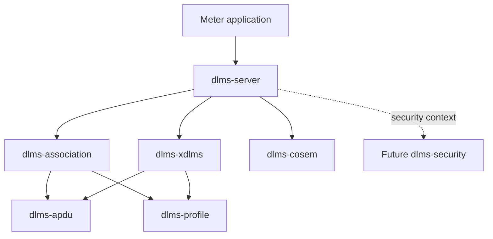
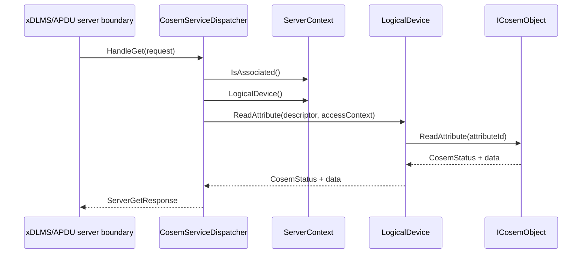
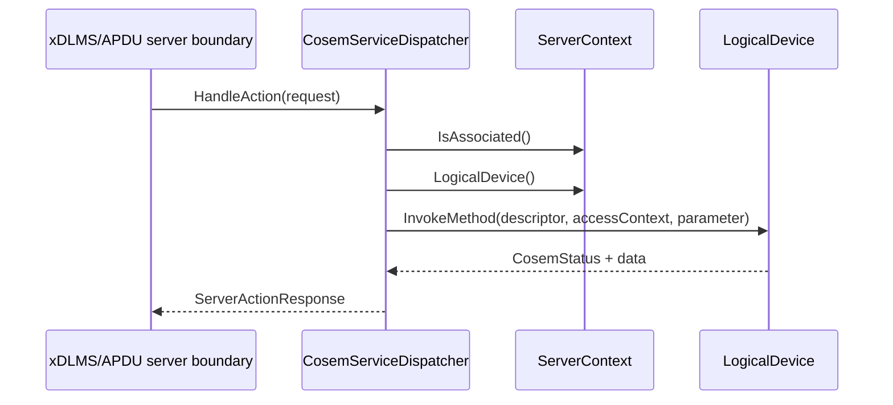
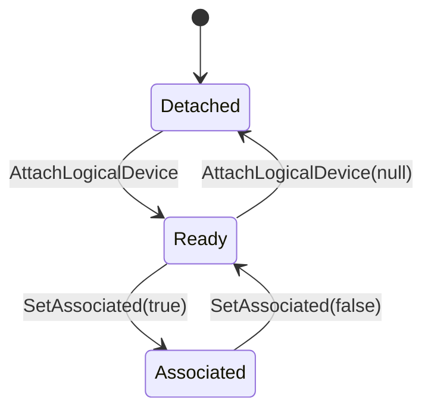
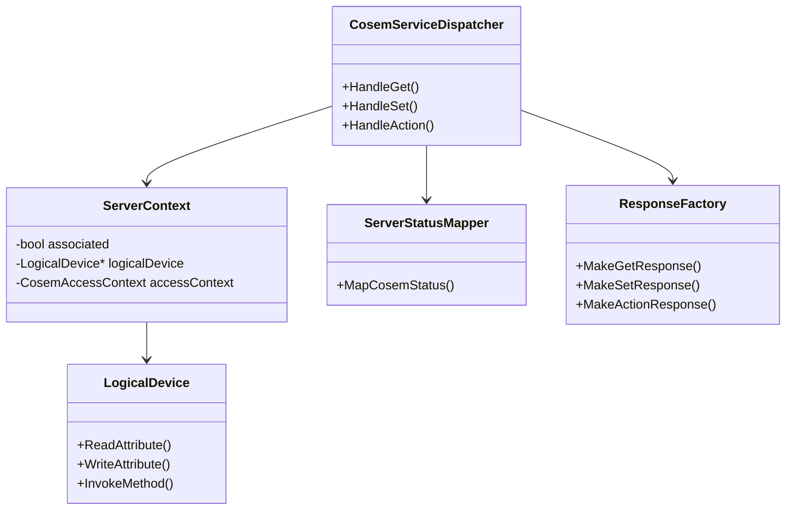

# dlms-server Architecture

## 1. Layer Position

`dlms-server` sits above APDU/profile/association concerns and above the COSEM
object model. The first implementation deliberately starts with decoded request
models, so the dispatcher can be tested without a transport stack.

## 2. Dependency Rules

Allowed first-phase dependencies:

- `dlms-cosem`.

Deferred dependencies:

- `dlms-xdlms` for server-side service request models when stable;
- `dlms-association` for server association state when stable;
- `dlms-apdu` for APDU response encoding;
- `dlms-security` for protected association contexts.

Forbidden dependencies:

- `dlms-transport`;
- direct `dlms-hdlc`, `dlms-llc`, or `dlms-wrapper`;
- application-specific object storage.

## 3. GET Flow

## 4. SET Flow

## 5. ACTION Flow

## 6. State Model

The first state model is intentionally small:

Requests are accepted only in `Associated` with a logical device attached.

## 7. Class Interaction

## 8. Error Model

The layer returns `ServerStatus` in every service response. Runtime paths do
not throw exceptions. COSEM object errors are mapped deterministically to
server statuses.

Output data is committed to a response only when the underlying operation
returns success.

## 9. Root Integration Strategy

Root integration shall initially add the submodule and later add
`add_subdirectory(lib/dlms-server)` after the repository has a stable CMake
target. End-to-end APDU tests are deferred until request/response encoding
contracts are stable.
