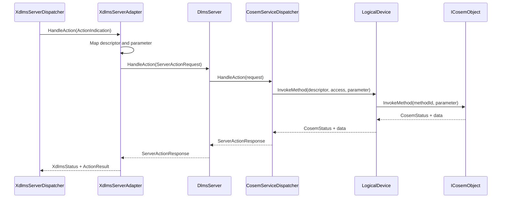
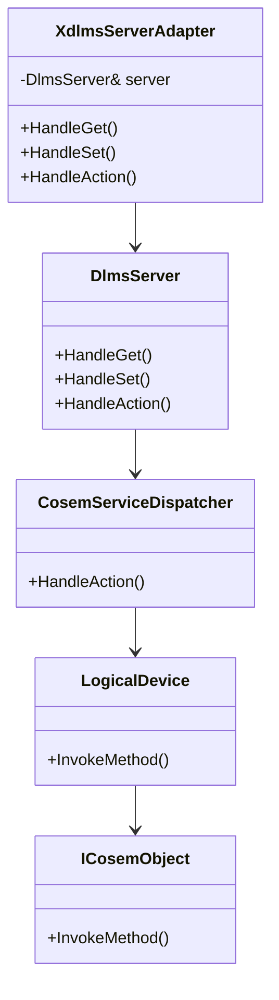

# xDLMS ACTION Adapter

## 1. Scope

This document defines the document-first boundary for adapting server-side
xDLMS ACTION indications into `dlms-server` request models.

In scope:

- implement `XdlmsServerAdapter::HandleAction`;
- map xDLMS method descriptors to COSEM method descriptors;
- forward encoded invocation parameter bytes to `ServerActionRequest`;
- map `ServerActionResponse` to `dlms::xdlms::ActionResult`;
- keep `CosemServiceDispatcher` as the only module that calls
  `LogicalDevice::InvokeMethod`.

Out of scope:

- APDU byte encoding and decoding;
- ACTION block transfer;
- ACTION with list;
- association negotiation;
- transport I/O;
- application object storage.

## 2. API Requirements

`XdlmsServerAdapter` shall implement the xDLMS server handler ACTION callback:

```cpp
dlms::xdlms::XdlmsStatus HandleAction(
  const dlms::xdlms::ActionIndication& indication,
  dlms::xdlms::ActionResult& result) override;
```

Mapping rules:

- `indication.invokeId` maps to `ServerActionRequest::invokeId`;
- xDLMS class id, logical name, and method id map directly to
  `ServerActionRequest::descriptor`;
- `indication.parameter` maps to `ServerActionRequest::parameter`;
- `ServerStatus::Ok` maps to `XdlmsStatus::Ok`;
- successful responses copy returned data only when `hasData` is true;
- object access failures map to ACTION result codes where the xDLMS model can
  carry them;
- association and missing logical-device failures map to xDLMS status failures.

The first implementation uses the existing encoded byte-buffer request model.
It does not decode invocation parameters inside `dlms-server`.

## 3. Architecture



## 4. Class Interaction



## 5. Test Plan

Unit coverage in `dlms-server`:

- adapter forwards class id, logical name, method id, invoke id, and parameter
  bytes;
- successful ACTION without return data maps to `XdlmsStatus::Ok`;
- successful ACTION with return data copies the encoded bytes;
- object/method access failures map to ACTION result failures;
- `NotAssociated` maps to `XdlmsStatus::NotAssociated`;
- `NoLogicalDevice` maps to `XdlmsStatus::InvalidState`;
- unsupported or internal failures map to xDLMS failure statuses.

Root integration coverage:

- normal ACTION APDU invokes a COSEM object method;
- optional invocation parameter bytes reach the object unchanged;
- optional return parameter bytes are encoded into
  `ACTION-RESPONSE-NORMAL`;
- access-denied/method-not-found returns a normal ACTION response with a
  failure result.
