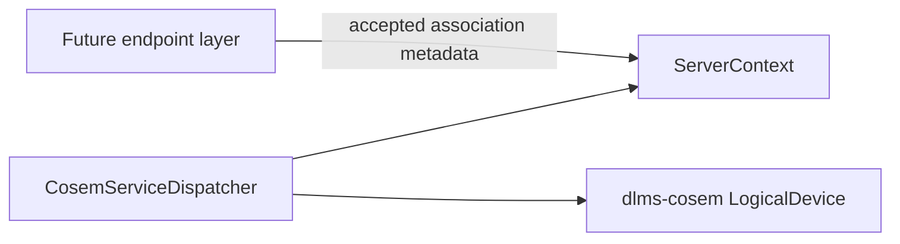
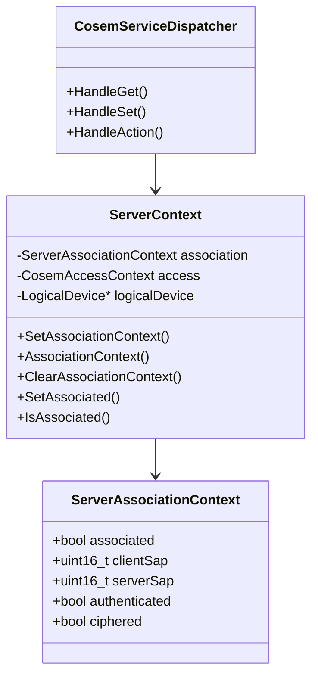

# Server Association Context Plan

## 1. Scope

Add server-side association metadata to `ServerContext` without introducing
transport, profile, APDU-channel, or association-negotiation dependencies.

`dlms-server` remains the decoded xDLMS-to-COSEM dispatch layer. Endpoint or
association layers will own AARQ/AARE, Wrapper/HDLC, TCP/serial, and event
loops. They can populate this metadata after an association is accepted.

## 2. Requirements

- `ServerContext` shall expose a small value object describing the active
  association.
- The metadata shall include:
  - association state;
  - client SAP;
  - server SAP;
  - authentication state;
  - ciphering state.
- Existing `SetAssociated()` / `IsAssociated()` behavior shall remain for
  callers that only need the boolean gate.
- Setting association metadata shall update the COSEM access context so
  authenticated associations receive authenticated COSEM access.
- Clearing association metadata shall return the server to public,
  not-associated state.
- No new dependency on `dlms-profile`, `dlms-transport`, `dlms-wrapper`,
  `dlms-hdlc`, or `dlms-association` is allowed in this phase.

## 3. API Shape

```cpp
struct ServerAssociationContext
{
  bool associated;
  std::uint16_t clientSap;
  std::uint16_t serverSap;
  bool authenticated;
  bool ciphered;
};

class ServerContext
{
public:
  void SetAssociationContext(const ServerAssociationContext& context);
  ServerAssociationContext AssociationContext() const;
  void ClearAssociationContext();
};
```

`SetAssociated(bool)` remains as a compatibility helper. It changes only the
association flag and preserves the existing access-context behavior unless the
new metadata setter is used.

## 4. Architecture



## 5. Class Interaction



## 6. Test Plan

- default context is not associated, public, SAPs zero, not ciphered;
- `SetAssociationContext()` stores SAP/security metadata;
- authenticated association metadata updates `AccessContext()` to
  authenticated;
- `ClearAssociationContext()` clears metadata and restores public access;
- existing boolean `SetAssociated()` tests remain valid.

## 7. Commit Message

```text
docs(server): define association context metadata
```
